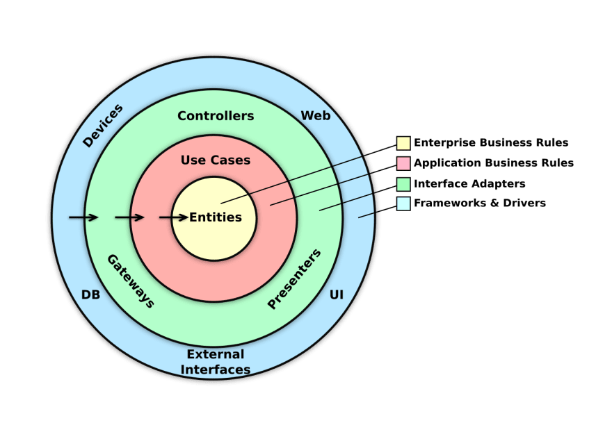

# Company Service

Demo Application to apply Clean Architecture concepts

## Technologies

- [`Java/OpenJDK 11`](https://openjdk.java.net/projects/jdk/11/) - Java Development Kit 11
- [`Lombok`](https://projectlombok.org/) - Annotation processor
- [`Docker`](https://www.docker.com/) - Containers
- [`Groovy`](https://groovy-lang.org/) - Tests execution
- [`Spock`](https://spockframework.org/) - Tests execution
- [`Test Containers`](https://www.testcontainers.org/) - Integration Tests execution

## Architecture

In this project the concept of Clean Architecture is used with modular separation;

    

